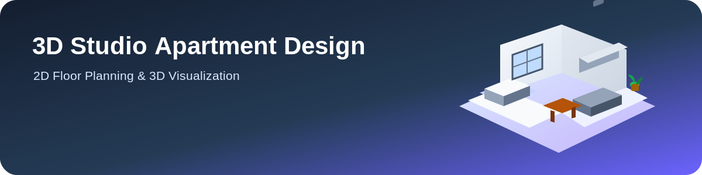

 

🏠 Single Studio Apartment Design

Designed Using 2D Floor Planning & 3D Visualization

 

  

  

🏠 About the Project

The Single Studio Apartment Design project focuses on designing a modern and functional studio apartment within a limited area of 28 ft × 22 ft.

The design includes a living and sleeping area, kitchen, dining area, and washroom. The project combines 2D floor planning and 3D visualization to present the layout, interior arrangement, and overall design.

🎯 Project Objectives

📐 Create a functional 2D apartment floor plan

🏠 Use the available space efficiently

🧊 Develop a 3D visualization of the design

🛋️ Arrange furniture and functional spaces properly

🪟 Consider natural lighting and ventilation

✨ Key Features

Feature

Description

📐 2D Floor Plan

Apartment layout with dimensions

🧊 3D Visualization

Three-dimensional representation

🛋️ Living & Sleeping

Central functional space

🍳 Kitchen

Counter and cabinet arrangement

🍽️ Dining Area

Dedicated dining space

🚿 Washroom

Separate private area

🪟 Windows

Natural light and ventilation

🏠 Flat Roof

Simple modern design

📏 Design Specifications

Component

Dimensions

Total Apartment Area

28 ft × 22 ft

Living & Sleeping Area

14 ft × 12 ft

Kitchen

8 ft × 6 ft

Washroom

5 ft × 4 ft

Dining Area

6 ft × 6 ft

Wall Height

10 ft

Door Height

7 ft

Window Size

4 ft × 3 ft

Roof Design

Flat Roof

🧊 3D Visualization

The 3D model provides a clear view of the apartment's spatial arrangement and interior design.

Included Elements

🛏️ Bed and living furniture

🛋️ Sofa arrangement

🍳 Kitchen cabinets and counter

🍽️ Dining setup

🚿 Washroom fixtures

🪟 Windows for lighting and ventilation

🛠️ Tools & Technologies

Tool

Purpose

AutoCAD

2D floor plan

SketchUp / Blender

3D modeling & visualization

Microsoft Word

Project documentation

⚠️ Challenges & Solutions

Challenge

Solution

Limited floor area

Efficient space planning

Functional area placement

Organized according to purpose

Furniture arrangement

Used practical positioning

Lighting & ventilation

Added strategically placed windows

🎓 Learning Outcomes

Through this project, I developed skills in:

📐 2D technical drawing

🧊 3D modeling and visualization

🏠 Residential space planning

📏 Dimensional planning

🛋️ Interior layout organization

👨‍🎓 Project Information

Detail

Information

Project Title

Design of a Single Studio Apartment

Student Name

S.M. Tanzim Hassan

Department

Computer Science & Engineering

Institution

East West University

Course Code

CSE200

Course Title

Computer Aided Engineering Drawing

Faculty

Nishat Tasnim, Lecturer

📝 Conclusion

This project demonstrates the use of 2D floor planning and 3D visualization to design a compact studio apartment. The final layout focuses on efficient space utilization, functionality, and a simple modern design approach.

⭐ Thanks for Visiting!

🏠 3D Studio Apartment Design & Visualization

Designed by S.M. Tanzim Hassan

Department of Computer Science & Engineering
East West University

 

📐 Design   •   🧊 Visualize   •   🏠 Create

  

Keep Learning ⚡ Keep Designing 🚀

